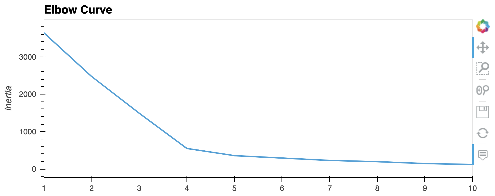
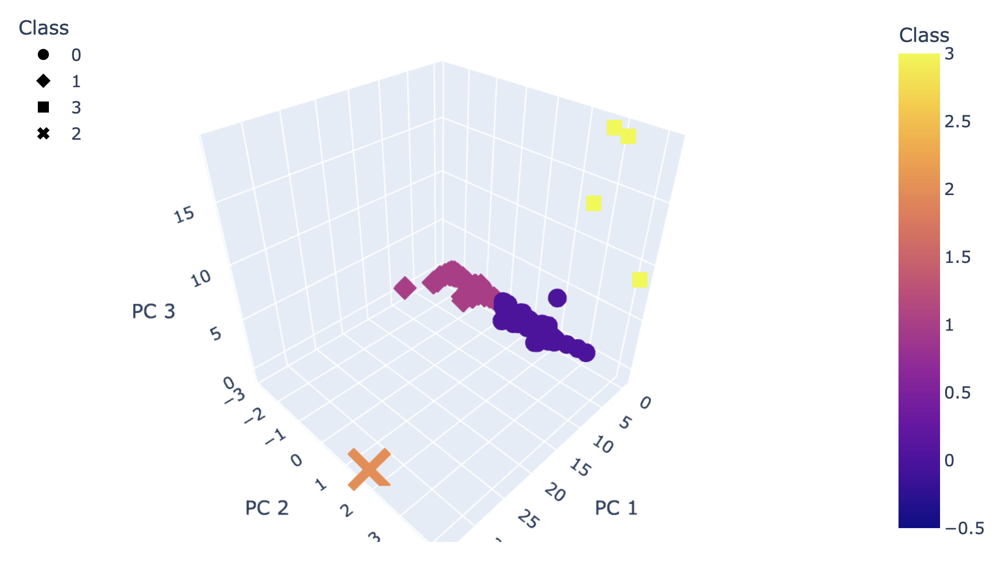
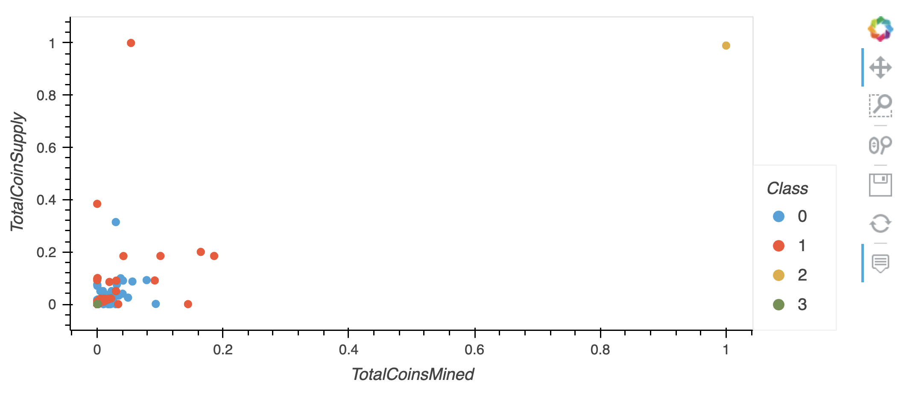

# Cryptocurrencies
Unsupervised Machine Learning and Cryptocurrencies

## Purpose

This Cryptocurrencies repository demonstrates an unsupervised learning workflow. The four main steps are preprocessing the data for principal component analysis (PCA), reducing the data dimensions using PCA, clustering cryptocurrencies using K-means, and visualizing the cryptocurrency results.

## Description

### Preprocessing the Data for PCA

Data on over 1250 cryptocurrencies was obtained in csv format from CryptoCompare.com. After preprocessing, 532 cryptocurrencies were available for further analysis. Preprocessing was as follows:
- Read the csv file and set the index column to the unique coin name (1252 coins).
- Keep only actively traded cryptocurrencies (1144 coins).
- Drop all rows with missing data (685 coins).
- Keep only those cryptocurrencies where coins have actually been mined (532 coins).
- There were four features:
    - Algorithm
    - ProofType
    - TotalCoinsMined
    - TotalCoinSupply
- Assign dummy variables to the Algorithm and ProofType features, which increased the feature count to 98.
- Scale the features with a gaussian (mean =  0, stdev = 1).

### Reducing Data Dimensions Using PCA

PCA was used to reduce the features to three principal components, which only explained 7% of the variance of the data.

### Clustering Cryptocurrencies Using K-means

Plotting an Elbow Curve suggested that the best value to use in the K-means algorithm was k=4.

The PCA algorithm has random components, so principal component values vary slightly. Two PCA/K-means trials were run (this analysis and starter code analysis), and model predictions of cluster groups were calculated.

Out of 532 cryptocurrencies, there was only one "swap." Looking at the 3-D scatterplot in the next section with coordinates (PC 1, PC 1, PC 3), BiblePay is group color purple at (-0.2, 1.9, 3.7) and Acute Angle Cloud is group color yellow at (-0.4, 4.2, 8.8). In the starter code trial, BiblePay is assigned group color yellow, and Acute Angle Cloud is assigned group color purple. Intuitively, one can understand this swap due to a small random perturbation in the PCA algorithm.

### Visualizing Cryptocurrencies Results

- The k=4 groups are reasonably separated in 3-D when plotted by the three principal component values.

- A sortable summary table was created.

- The total coin supply vs. total coins mined was displayed in a scatterplot.
    - TurtleCoin and BitTorrent have by far the greatest total coin supply
    - BitTorrent has by far the greatest total number of coins mined.
    - Most cryptocurrencies have a relatively low total coin supply and have had relatively few total coins mined. (In some cases, this is by design. 42 Coin has a total coin supply of 42 coins with 41.999954 total coins mined.)

